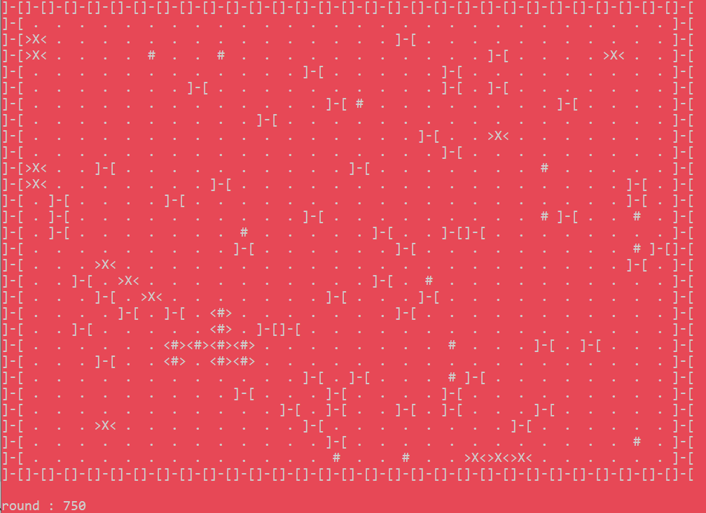
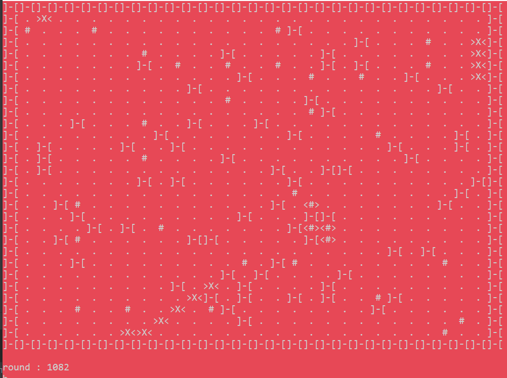
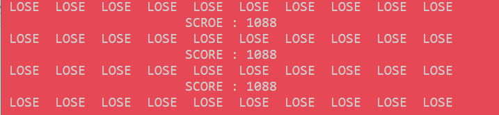

# game_bunker
Маленькая консольная игра из 9 класса

_____

## Запуск

Скачать файлы и запустить из cmake-build-debug bunker.exe
_____

## Фото из игры 

_____

## Суть игры

Управление на wasd + enter. Вы - маленький корабль <#>, вам необходимо летать по плоскому миру и искать своих собратьев #, соединятся с ними и летать дальше.
Вам всячески в огромном кол-ве пытаются помешать <X>. Однако на карте присутствуют ]-[, которые убивают всех, кто на них натыкается. Так же при пересечении <X> и ваших кораблей, появляется очередная ]-[, пользуясь прямолинейностью врагов, способностью пополнять свои ряды и терять, вы можете создать для себя бункер для вечной жизни. 
  
  __
  
  ## Помимо
  
  Где-то есть вторая версия игры, которая реализованна на графическом движке и с ллогическим концом. Но может потом найду и залью
